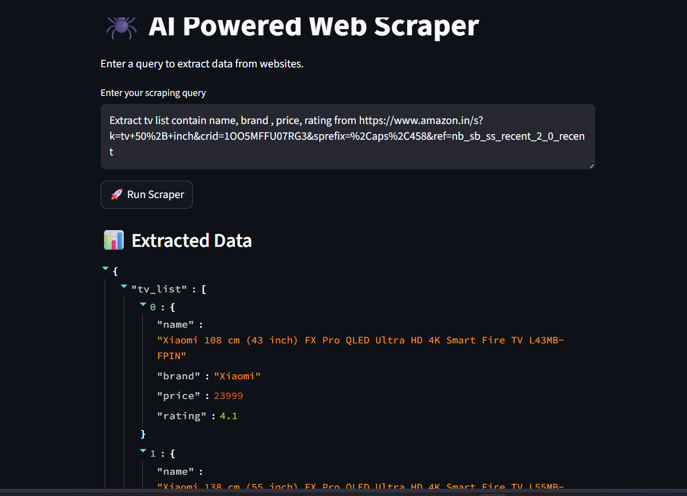
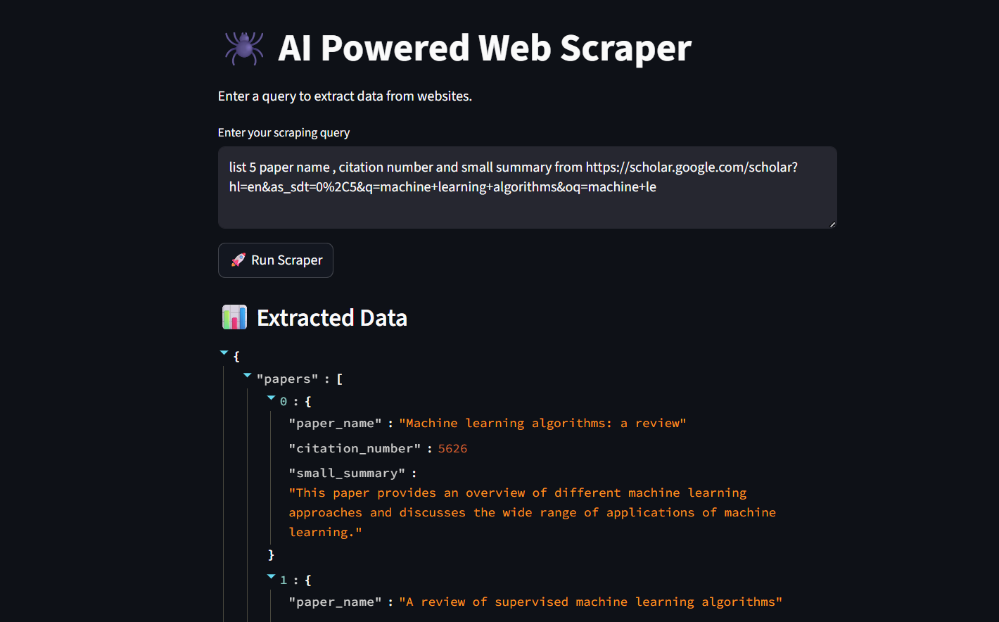
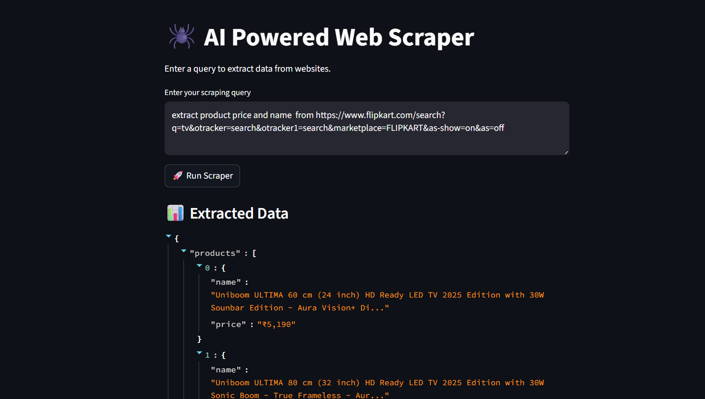

# 🚀 AI-Powered Dynamic Web Scraper  
### *Zero Selectors. Pure Intelligence.*

Scrape **any website** using **natural language** — no CSS selectors, no XPath, no manual parsing.

> 💡 Just provide a URL and describe what data you want. The AI extracts it.

---

An **AI-powered universal scraper** that:

- Takes **URL + plain English query**
- Understands webpage structure using LLMs
- Dynamically generates schema
- Outputs clean structured data (JSON / CSV)

---

## ⚙️ Features

- 🧠 **LLM-based extraction (Zero selectors)**
- 🌐 Works across multiple website types
- 📄 Dynamic schema generation
- 🔄 Pagination support (multi-page scraping)
- 🧩 Graceful handling of missing fields (`null`)

---

## 🧱 Tech Stack

| Layer            | Technology |
|-----------------|-----------|
| Crawling        | Crawl4AI |
| Orchestration   | LangGraph |
| LLM             | GPT-4o-mini / Gemini 2.0 Flash |
| Validation      | Pydantic + Instructor |
| UI              | Streamlit |
| Output          | JSON / CSV |

---

## 🏗️ Architecture

```text
User Input (URL + Prompt)
        │
        ▼
Dynamic Schema (Pydantic)

        │
        ▼
LLM (Understand + Extract)
        │
        ▼
Crawl4AI (Fetch)
        │
        ▼
Structured Output (JSON / CSV)

```

## Add .env file
```
OPENAI_API_KEY=your_api_key
```

## Results

### Amazon


### Google Scholar


### Flipkart



